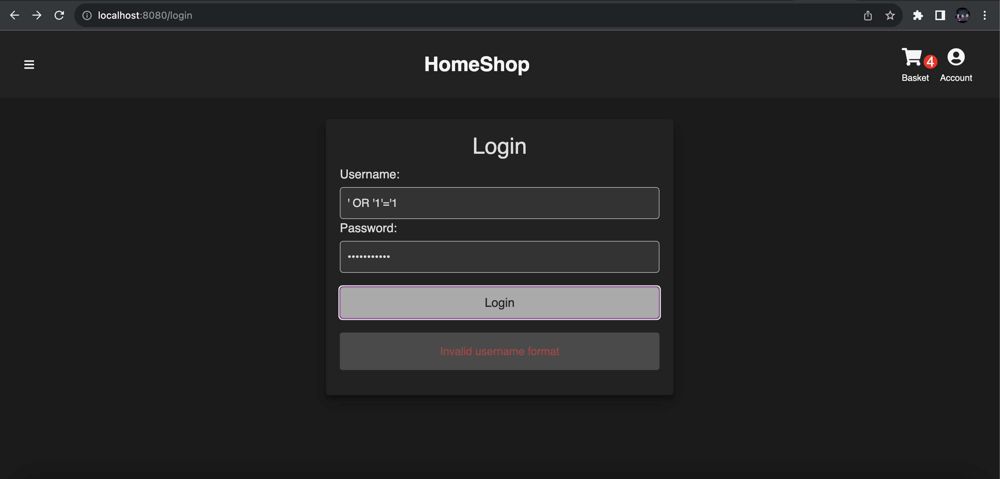
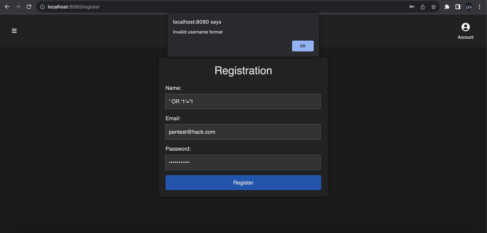

---

# Vulnerability Remediation Report

---

### Pentest write-up:

**Author**: Jackson Stephens
**Date**: December 12th, 2023

---

## Directory Traversal:

- **Initial Vulnerability**: 

Originally, the web application was vulnerable to directory traversal attacks. This means that the attacker could be at the "/login" enpoint, delete "/login" from the URL, then 
have access to the web application as if they were an authorized user. 

Both the Login and Register Files:

**Old Code**:
```javascript
const filepath = request.query.filepath;
const fileContent = fs.readFileSync(`/app/data/${filepath}`, 'utf8');
```
**New Code**:
```javascript
const path = require('path');
const baseDirectory = '/app/data/';

const filepath = request.query.filepath;
const normalizedPath = path.join(baseDirectory, filepath);

if (normalizedPath.startsWith(baseDirectory)) {
  const fileContent = fs.readFileSync(normalizedPath, 'utf8');
} else {
}
```

**Remediation**: 
I implemented code that requires proper authentication before redirecting to the main page of the web application. This 
prevents attackers from accessing sensitive directories specific to authorized users by manipulating the URL of the web application.

---

## SQL Injection:

- **Initial Vulnerability**: 

Originally, the web application was vulnerable to SQL injection, meaning that a user could input a basic SQL injection script such as "' OR '1'='1" which 
would give the attacker administrator priveleges in the web application. 

Both the Login and Register Files:

**Old Code**:
```javascript
const query = `SELECT * FROM users WHERE username = '${username}' AND password = '${password}'`;
database.execute(query);
```

**New Code**:
```javascript
const query = `SELECT * FROM users WHERE username = ? AND password = ?`;
database.execute(query, [username, password]);
```
**Remediation**: 

In this code, I changed the "/login" and "/register" endpoints to only accept parameterized queries. By doing so, ensuring that 
user input is treated as data, not an SQL query, mitigating the risk of SQL injection attacks. 

---

## Cross-site Scripting (XSS)

- **Initial Vulnerability**: 

Originally, the web application was vulnerable to XSS attacks at every point of contact that took in user input. This left the web applicaiton 
vulnerable to malicious code injection. 

Customer Feedback File:

**Old Code**:
```javascript
methods: {
  async submit() {
    ...
    const feedbackData = {
      userId: this.userId,
      author: this.author,
      feedback: this.feedback,
      rating: this.rating,
    };
    ...
  },
},
```
**New Code**:
```javascript
methods: {
  sanitizeInput(input) {
    const div = document.createElement('div');
    div.textContent = input;
    return div.innerHTML;
  },
  async submit() {
    ...
    const sanitizedAuthor = this.sanitizeInput(this.author);
    const sanitizedFeedback = this.sanitizeInput(this.feedback);
    const feedbackData = {
      userId: this.userId,
      author: sanitizedAuthor,
      feedback: sanitizedFeedback,
      rating: this.rating,
    };
    ...
  },
},
```
Login File:

**Old Code**:
```javascript
methods: {
  async loginUser() {
    ...
    console.log("The JWT secret is 'secret' lol");
    ...
  },
},
```
**New Code**:
```javascript
methods: {
  async loginUser() {
    ...
    ...
  },
},
```
Register File:

**Old Code**:
```javascript
methods: {
  validateInput() {
    ...
    if (!this.username.match(usernameRegex)) {
      alert("Invalid username format");
      return false;
    }
    ...
  },
},
```
**New Code**:
```javascript
methods: {
  validateInput() {
    ...
    if (!this.username.match(usernameRegex)) {
      this.error = "Invalid username format";
      return false;
    }
    ...
  },
},
```

**Remediation**: 

In this code, I sanitized user inputs in the customer feedback form, "/login" and "/register" endpoints. By doing so, 
protecting against cross-site scripting attacks and other malicious injection techniques. 

## Testing Evidence:

  - **Vuln 1**: In my tests, I attempted to access files and directories without being logged in or authenticated. 
  I have concluded that the web application no longer allows access to unauthorized files, indicating successful remediation.

    #1: 
        - [Default login path]
        <br><br>
    #2. 
        - [Attempting to change directories without authentication]
        <br><br>
    #3. 
        - [Access denied]
        <br><br>

  - **Vuln 2**: In my tests, I attempted to perform a basic SQL injection into the website to gain administrative privileges. 
  I have concluded that the web application no longer accepts or returns data of that format, indicating successful remediation. 

    #1. 
        - [SQL injection attempt failing at the login endpoint]
      <br><br>
    #2. 
        - [SQL injection attempt failing at the register endpoint]
      <br><br>

  - **Vuln 3**: In my tests, I attempted to use a basic XSS attack method to determine whether the website was still vulnerable to XSS attacks. 
  I have concluded that the web application is no longer vulnerable to cross-site scripting attacks, indicating successful remediation. 

    #1. 
        - [XSS attempt failing at the login endpoint]
      <br><br>
    #2. 
        - [XSS attempt failing at the register endpoint]
      <br><br>
    #3. 
        - [XSS attempt failing at the contact (customer feedback) endpoint]
      <br><br>

---

**Conclusion**:

Overall, following the provided remediation above, the website is now: 

  1. Protected against cross-site scripting attacks at the "/contact", "/login", and "/register" endpoints. 
  2. Protected against SQL injection by the use of parameterized queries. 
  3. Protected from directory traversal attacks through authentication and validation handling. 

These improvements help mitigate the risk of cross-site scripting and SQL injection attacks and enhance the file management security. This   
significantly improved the security posture of the web application. Moving forward, it's important that you continue to vulnerability test your 
web application as I have just done. By doing so, mitigating the risk of future vulnerabilities. 

Considering you have any other questions or concerns, feel free to contact me @jack456@byu.edu. 

---
